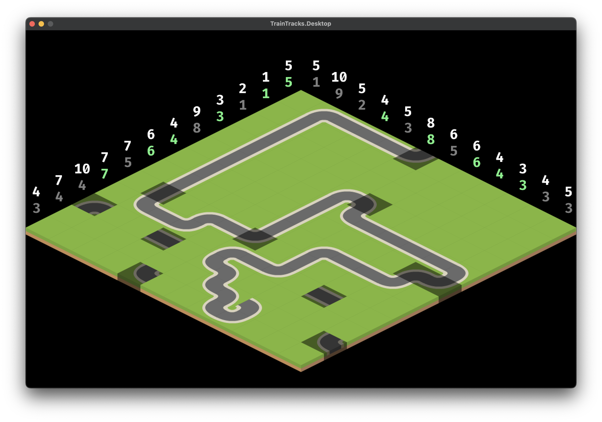

# Train Tracks

An engine based around the Train Track puzzle games.

## Puzzles States

```
 #  | Size    | Time     | Iterations | Correct |
----+---------+----------+------------+---------+
 0  | (12x12) | ~1.5s    | ~17m       | Yes     |
 1  | (12x11) | ~0.2s    | ~700k      | Yes     |
 2  | (11x11) | ~0.2s    | ~650k      | Yes     |
 3  | (11x12) | ~0.2s    | ~800k      | Yes     |
 4  | (6x6)   | <0.01s   | ~250       | Yes     |
 5  | (6x6)   | <0.01s   | ~40        | Yes     |
 6  | (9x9)   | <0.01s   | ~250k      | Yes     |
 7  | (9x9)   | ~0.01s   | ~850       | Yes     |
 8  | (10x10) | ~0.01s   | ~250       | Yes     |
 9  | (12x11) | ~0.1s    | ~350k      | Yes     |
 10 | (7x6)   | <0.01s   | ~1.5k      | Yes     |
 11 | (11x12) | <0.1s    | ~20k       | Yes     |
 12 | (10x7)  | <0.01s   | ~6k        | Yes     |
 13 | (6x10)  | <0.01s   | ~200       | Yes     |
 14 | (9x10)  | ~0.1s    | ~500k      | Yes     |
 15 | (10x8)  | ~0.5s    | ~2.5m      | Yes     |
 16 | (10x10) | <0.1s    | ~250k      | Yes     |
 17 | (12x11) | ~1.5s    | ~15m       | Yes     |
 18 | (12x12) | ~1m      | ~900m      | Yes     |
 ```

## Screenshot

